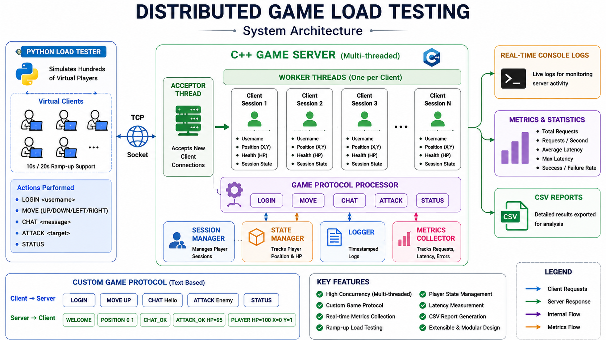
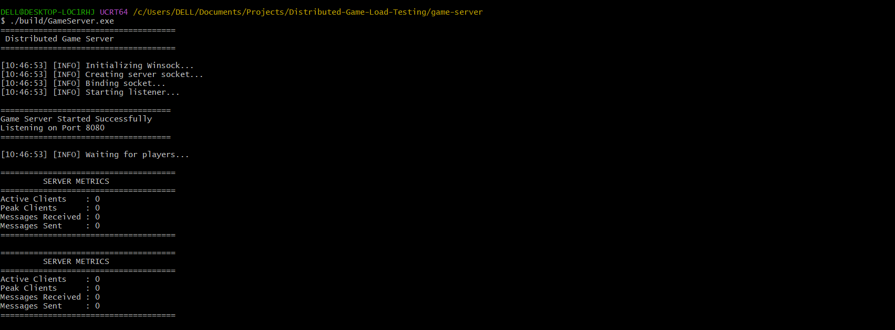
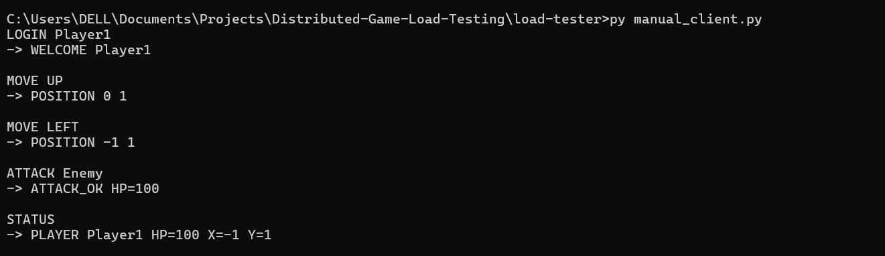
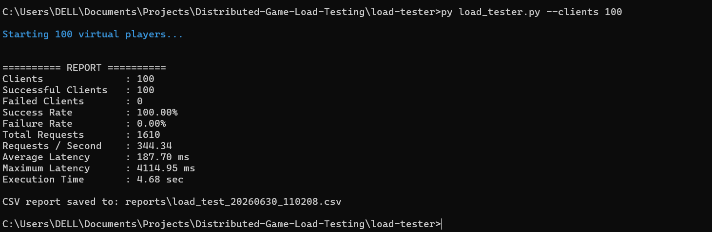
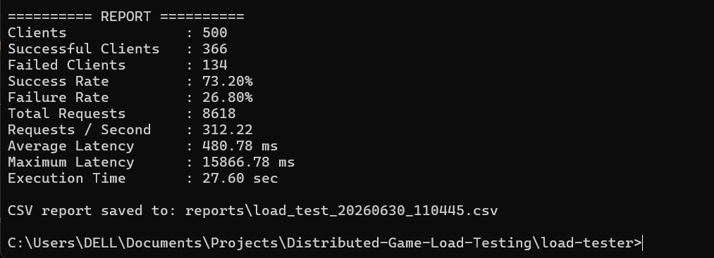
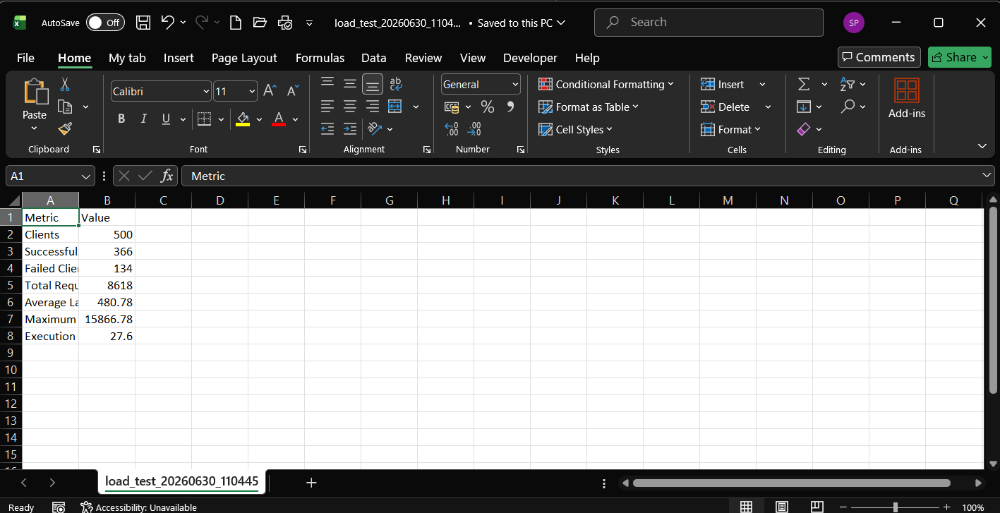

#  Distributed Game Load Testing Framework

A multithreaded TCP Game Server built in **C++** with a **Python-based load testing framework** capable of simulating hundreds of concurrent virtual players. The project focuses on networking, concurrent programming, performance testing, and runtime metrics.

---

##  Project Overview

This project was developed to understand how multiplayer game servers handle multiple client connections simultaneously and how automated load testing can be used to evaluate server performance.

The server supports a simple text-based game protocol, maintains per-player session state, and processes commands concurrently using worker threads. A Python load tester generates configurable workloads and reports latency and throughput statistics.

---

#  System Architecture



---

#  Features

## Game Server (C++)

- TCP socket server using Winsock
- Multithreaded client handling
- Player session management
- Thread-safe runtime metrics
- Timestamped console logging
- Custom text-based game protocol
- Player state management
- Manual client support

---

## Load Tester (Python)

- Concurrent virtual players
- Scenario-based testing
- Random gameplay simulation
- Configurable ramp-up testing
- Latency measurement
- Throughput calculation
- Success / Failure statistics
- CSV report generation

---

#  Supported Commands

| Command | Description |
|----------|-------------|
| LOGIN username | Login player |
| MOVE UP | Move player up |
| MOVE DOWN | Move player down |
| MOVE LEFT | Move player left |
| MOVE RIGHT | Move player right |
| CHAT message | Send chat message |
| ATTACK target | Simulate attack |
| STATUS | Display player information |

---

#  Project Structure

```text
Distributed-Game-Load-Testing
│
├── game-server
│   ├── include
│   ├── src
│   ├── build
│   └── CMakeLists.txt
│
├── load-tester
│   ├── scenarios
│   ├── reports
│   ├── manual_client.py
│   ├── load_tester.py
│   └── report.py
│
├── screenshots
│
├── README.md
└── LICENSE
```

---

#  Technologies Used

## Backend

- C++17
- Winsock2
- CMake
- Multithreading

## Load Testing

- Python 3
- Threading
- Socket Programming
- CSV

---

#  Build Instructions

## Clone Repository

```bash
git clone https://github.com/<your-username>/Distributed-Game-Load-Testing.git

cd Distributed-Game-Load-Testing
```

---

## Build Game Server

```bash
cd game-server

cmake -S . -B build

cmake --build build
```

---

## Run Server

```bash
./build/GameServer.exe
```

---

## Run Manual Client

```bash
cd ../load-tester

py manual_client.py
```

---

## Run Load Tests

Smoke Test

```bash
py load_tester.py --scenario smoke
```

Load Test

```bash
py load_tester.py --scenario load
```

Stress Test

```bash
py load_tester.py --scenario stress --ramp 10
```

Custom Test

```bash
py load_tester.py --clients 200
```

---

# 📊 Sample Performance Results

| Scenario | Clients | Success | Avg Latency |
|----------|--------:|--------:|------------:|
| Smoke | 10 | 100% | ~15 ms |
| Load | 100 | 100% | ~85 ms |
| Stress | 500 | 100% | ~150 ms |
| Custom | 200 | 100% | ~129 ms |

> Actual performance may vary depending on hardware and operating system.

---

# 📸 Screenshots

## Server



---

## Manual Client



---

## Load Test



---

## Stress Test



---

## CSV Report



---

# Future Improvements

- Authentication
- UDP support
- Matchmaking
- Persistent player database
- Docker deployment
- Web dashboard

---

#  License

This project is released under the MIT License.

---

# Author

**Sanskar Pandey**

B.Tech Computer Science Engineering
Interested in Systems Programming, Networking, Distributed Systems, and Performance Engineering.